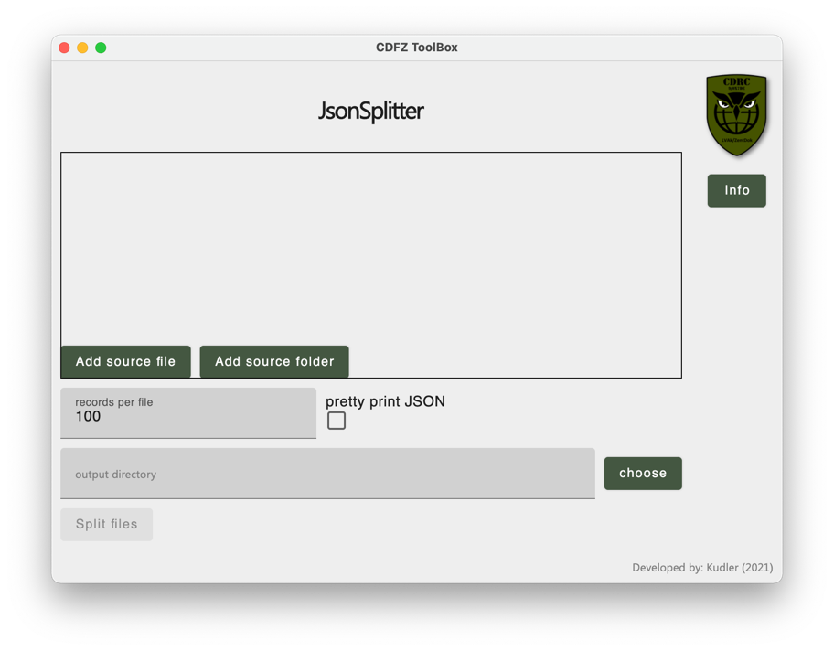
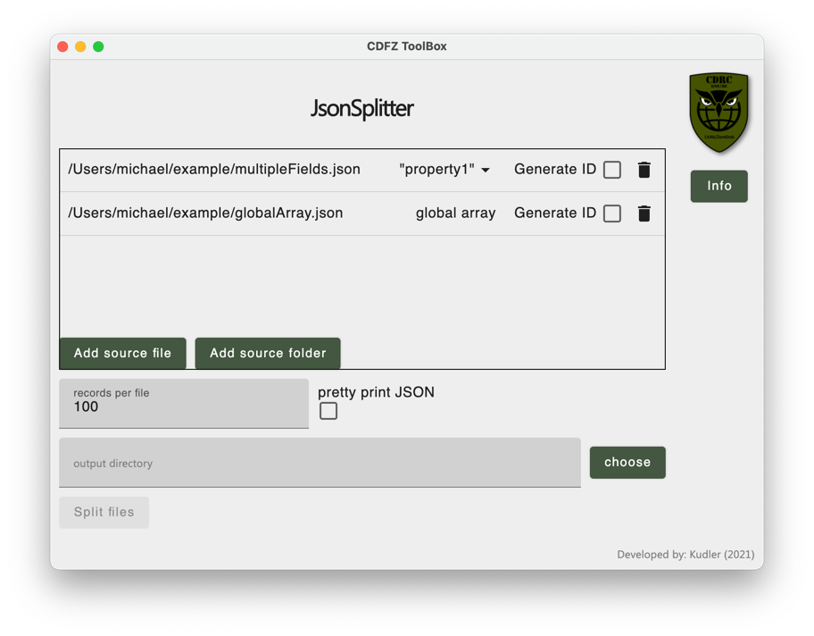
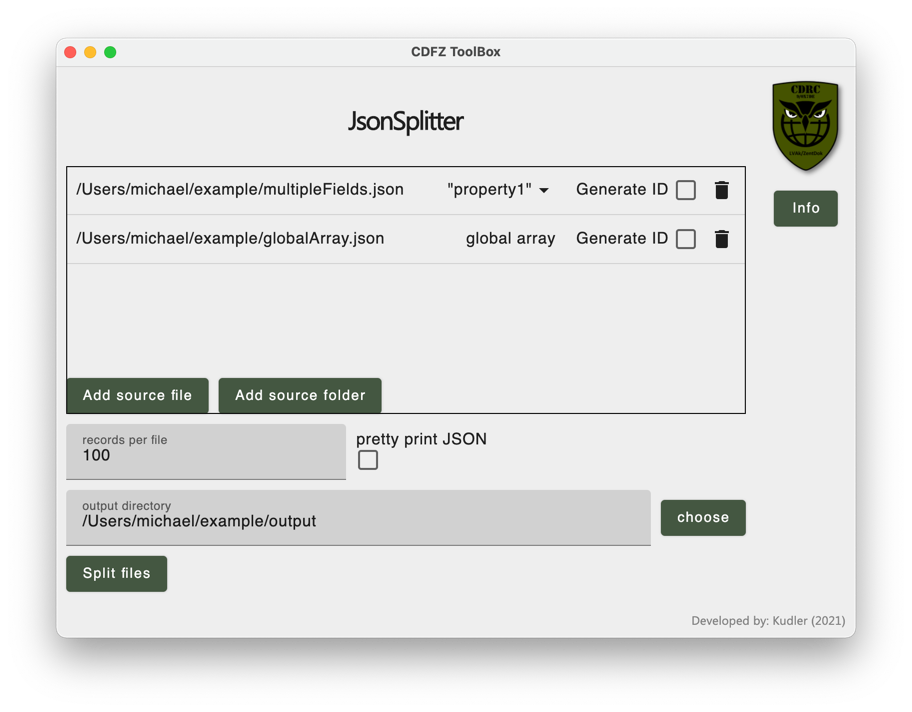
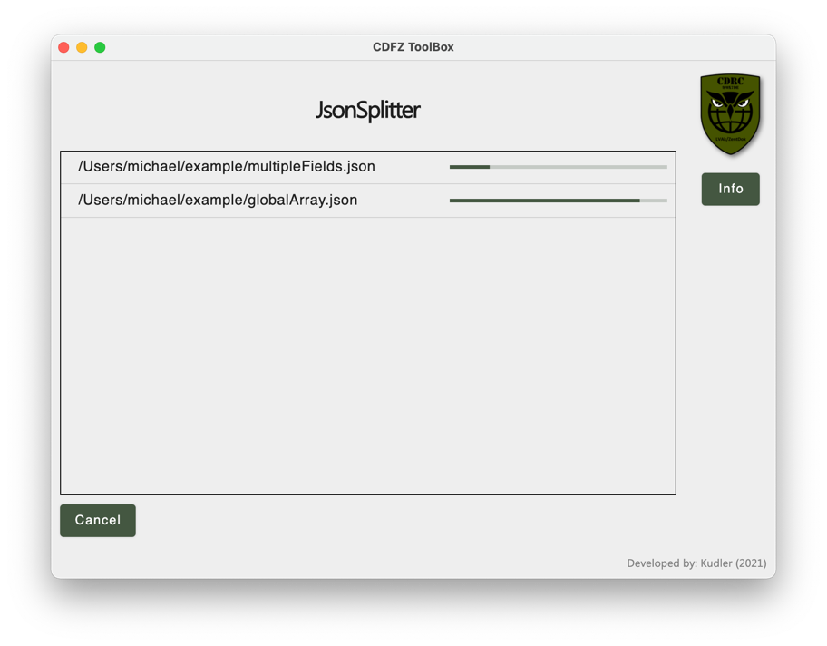
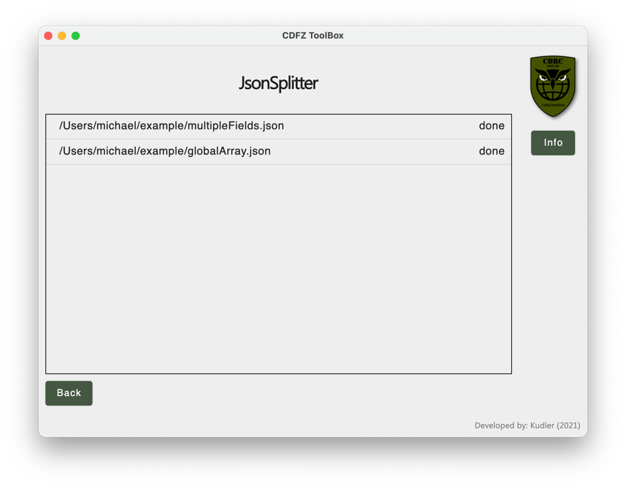
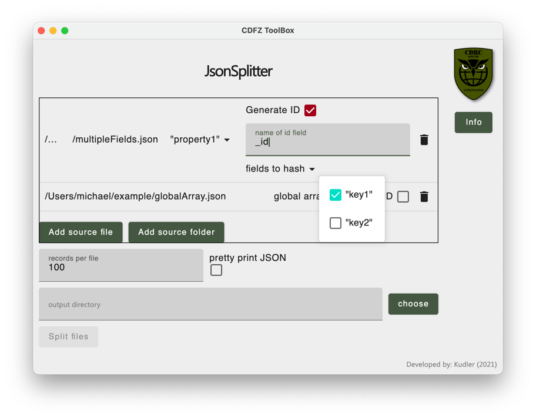

# jsonsplitter

NAME| PROPERTY
--------|-------
Title: | jsonsplitter
Description: | splits JSON documents
Project Date: | 13.11.2020 - 15.02.2021
Project Manager: | Michael KUDLER
Developer: | Michael KUDLER
Initiator: | Hans Christian PILLES
<br/>

## Initial situation
Currently, JSON documents with a size of several gigabytes are difficult to be processed because of their size. 

## Implementation
NAME| PROPERTY
--------|-------
Operating System(s): | Windows, macOS, Linux
Programming Language: | Kotlin
Development Environment: | IntelliJ
Additional Libraries: | Compose for Desktop 0.2.0<br/> Moshi 1.11.0
<br/>

This application uses Compose for Desktop as its UI framework and Moshi for all underlying JSON parsing and writing.

## Installation

### Windows
Download and execute the MSI installer [here](https://gitlab.cdfz.at/cdfz-toolbox/jsonsplitter/uploads/66154b3c5aa645f55489fe1d998f2388/json_splitter-1.2.msi). A desktop shortcut will be added automatically.

### macOS

Download and execute the DMG image [here](https://gitlab.cdfz.at/cdfz-toolbox/jsonsplitter/uploads/6f997884ad0ee37bf4baadc683661353/json_splitter-1.2.dmg).

## Usage
### Minimal use case
Once opened the main menu appears



Click "Add source file" to add a single JSON file or "Add source folder" to add many files at once.



Depending on the kind of JSON document you can now select which key's data to split. If it is a global array there are no keys and no selection is possible. The same goes for files with only a single possible key.



The last step before the splitting can begin is setting the output directory. The path can be entered manually or by clicking "choose" and using the provided file chooser.

Clicking "Split files" starts the splitting process.



Finally, all files should end up on "done".



### Options


Optionally, an ID can be generated for each record. If ID-generation is enabled the name of the desired ID-field can be specified, and the record fields that make up the ID can be selected. The ID is computed by a chained SHA-1 hash of the fields values.

The "records per file" option lets you specify, how many records should be put in a single file. The actual file size in bytes depends on the sizes of each individual record and can vary from file to file.

"pretty print JSON" enables pretty printing for the output files. That means instead of `{key:"value"}` you get
```
{
  key: "value"
}
```